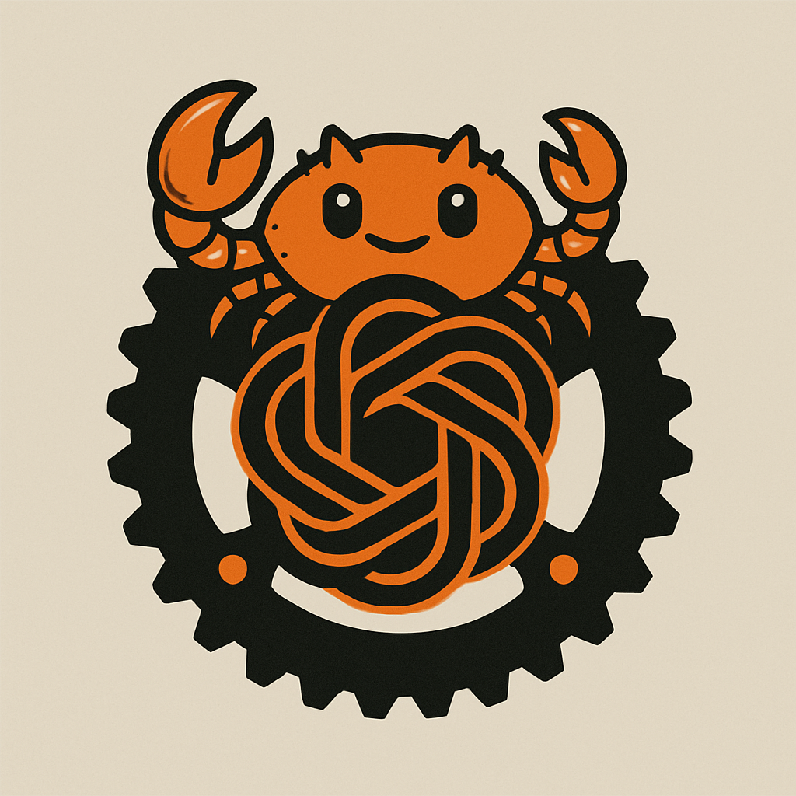

# Rust Backend Gen Agents

This Rust project implements a modular agent-based backend architecture designed to handle code generation tasks through collaboration between specialized agents.



## 🚀 Purpose

The goal of this project is to simulate a team of cooperative agents that generate backend code components from high-level instructions. Each agent has a distinct role, contributing to a pipeline that results in generated backend code artifacts like endpoints, routes, and service logic.

## 🤖 Agents

There are **three primary agents** in the system, each with a clear and unique responsibility:

1. **Project Manager**

2. **Solution Architect**

3. **Backend Developer**

## 🧪 Example

You can test the system by running:

```bash
cargo run
```
The console will ask you to describe your project. The more information you give, te better.